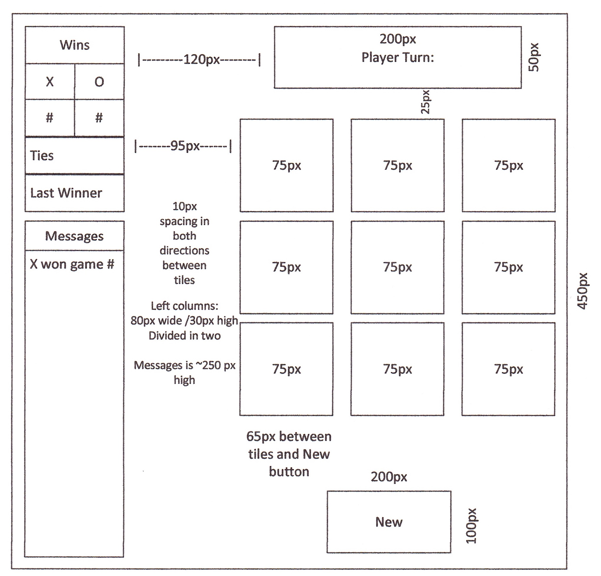

<h2>Primary User Stories for MVP:</h2>
<ul>
<li>As a user, I should be able to start a new tic tac toe game</li>
<li>As a user, I should be able to click on a square to add X first and then O, and so on</li>
<li>As a user, I should be shown a message after each turn for if I win, lose, tie or who's turn it is next</li>
<li>As a user, I should not be able to click the same square twice</li>
<li>As a user, I should be shown a message when I win, lose or tie</li>
<li>As a user, I should not be able to continue playing once I win, lose, or tie</li>
<li>As a user, I should be able to play the game again without refreshing the page</li>
</ul> 
<h2>Additional Features Implemented:</h2>
<ul>
<li>Keep track of multiple game rounds with a win, lose and tie counter</li>
<li>Make your site fully responsive so that it is playable from a mobile phone</li>
</ul> 
<h2>Approach</h2>
<ul><li>For the UI, the goal was to keep it as simple as possible on a canvas that would fit a PC monitor as well as an iPhone XS without the need to scroll.
<li>The game tiles are large enough to either tap or click.
<li>A message box at the top of the board would change to the color of the current user's turn. If a game is not in progress, then a message would state to click on a new game. The message box would also inform the user if they clicked on an already chosen tile.  Originally, the latter two points were alerts but later reworked into the message box.
<h2>Wireframe:</h2> 
This was significantly altered in favor of a cleaner design and space constraints, i.e. fitting on an iPhone XS screen.

<h2>Technologies used:</h2>
<h3>HTML</h3>
<h3>CSS</h3>
<ul><li>Arranged everything in vertical grids to keep the UI as clean as possible with the intent of fitting on an iPhone XS screen and scaling to PC monitors.</li>
</ul>
<h3>Javascript</h3><ul>
<li>Used a set of global variables to keep track of counters such as wins, player choices and colors. Also used an array of arrays to determine the winning combinations and comparing those against the choices of the players. If there was a winning combination, then the game would end. More details are in the code but here is a high-level summary of the functions used:
<li><b>startGame</b> - initialized certain variables. Needed for when the New Game button is clicked on or when the page is accessed for the first time.
<li><b>takeTurn</b> - looks at an array of player turns (x or o) and first confirms if a game isn't in progress. Upon choice of tile, the tile turns to the color of the player. It also increments a turnsPlayed variable to keep track of the number of turns played.
<li><b>validateTile</b> - confirms if the tile was already selected. If it was, prompt the user to select another; if not, then allow the tile to be chosen.
<li><b>recordTurn</b> - updates the choices array with the player and their selection. The array is ordered and populated based on the ID of the tile.
<li><b>validateWinner</b>* - on and after turn 5, the function compares all of the winning choices to the player choices array formed in recordTurn. If there is a match, then a winner is declared. If no winner after turn 9, then the game is considered a tie.
<li><b>finishGame</b> - sets the message on who won (or tie). Also increments the gamesPlayed variable which is used in the scorebox.
<li><b>displayCounter</b> - shows the number of wins, per player, and ties.

<li>Each tile has a 'click' event handler which calls the takeTurn function.
</ul>
<h4>https://hackernoon.com/building-tictactoe-using-vanilla-javascript-kt2b32mp was a resource used for inspiration in determining the winner. In previous attempts, I compared the player selections to the winning scenarios; however, it always took into account the middle tile even when that was not part of the winning combination. This site demonstrated comparing the winning scenarios to the player selections.</h4>

<h2>Future features:</h2>
<ul>
<li>Sound effects on win/lose/tie or selection
<li>Animation effects on win/lose/tie
<li>Hover over tile before selection
<li>Expanding game grid (4x4, 5x5, ultimate tic-tac-toe, etc.)
<li>Customization of users including names, colors, and avatars.
</ul>